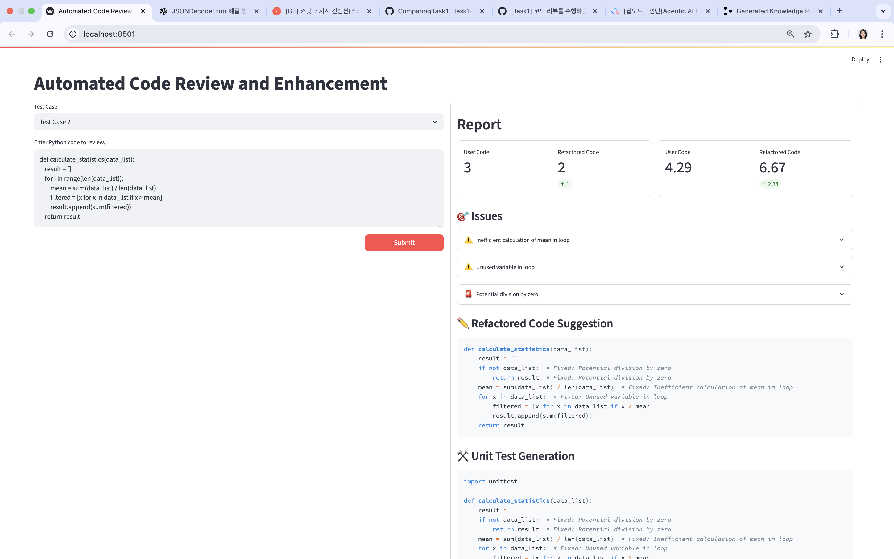

# AgenticAI 

## Setup
* 해당 레포를 클론받고, 폴더 내 진입한 후 scripts 폴더 안 install.sh 파일을 실행해주세요.
* Windows OS의 경우 스크립트 실행 시 `bash` 명령어를 추가해주세요.
```bash
$ git clone https://github.com/dev-hjJoo/AgenticAI_DeepAuto.ai.git
$ cd AgenticAI_DeepAuto.ai
$ scripts/install.sh
```

## Running
* scripts 폴더 안 start.sh 파일을 실행하면 로컬에서 FE(Streamlit), BE(FastAPI) 서버가 동시에 열립니다.
```
$ scripts/start.sh
```


## Overview
* 사용자가 입력한 코드에 대해 LLM을 이용하여 자동으로 리뷰를 수행하는 서비스입니다.
  1. 사용자가 입력한 코드의 버그, 보안 이슈, 성능 문제를 찾아냅니다.
  2. 찾아낸 이슈에 대해 개선한 리팩토링 코드를 제안합니다.
  3. 리팩토링 코드의 단위 테스트를 수행할 수 있는 코드를 제안합니다.
* **Streamlit**을 프론트엔드로, **FastAPI**를 백엔드로 사용하는 간단한 웹 애플리케이션입니다.  
* FastAPI는 API 요청을 처리하고, Streamlit은 사용자 인터페이스(UI)를 제공합니다.
```
AGENTICAI_DEEPAUTO
├── be/
│ ├── agent     # Agent 관련 코드(예: CodeReviewAgent 클래스 및 노드) 모음 
│ ├── .env      # OpenAI API Key 등 비밀 정보가 포함된 파일 (⭐️실행 전 추가 필요!⭐️)
│ └── main.py   # FastAPI의 API 리스트
│
├── fe/
│ ├── data            # 필요 데이터(예: 테스트 케이스)가 들어 있는 폴더
│ ├── utils           # FE 코드 전체에서 공통으로 사용하는 코드(예: Singleton 데코레이터)가 들어있는 폴더
│ ├── api_client.py   # BE 서버로 API 요청을 수행하는 코드
│ └── main.py         # Streamlit App UI 및 FE 로직 코드
│
├── docs/
│ ├── graph_output.png   # 현재 Agent 그래프 시각화 이미지
│ └── Presentation.pdf   # 현재 레포에 작업된 내용을 설명하는 간략한 발표 자료
│
├── scripts/
│ ├── install.sh  # 웹 서버 실행에 필요한 패키지 설치 스크립트
│ ├── run_be.sh   # BE 서버 실행 스크립트
│ ├── run_fe.sh   # FE 서버 실행 스크립트
│ └── start.sh    # 웹 서버(FE+BE) 통합 실행 스크립트
│
├── requirements.txt # 프로젝트 전체에서 필요한 공통 의존성 파일
└── README.md
```

### Screenshots
